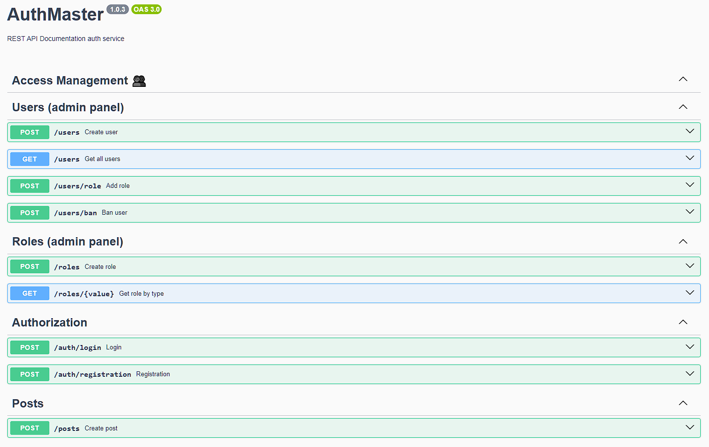

**Read in another language: [Ukrainian](README.ua.md).**

# Backend REST API "AuthMaster_Back"

This repository contains a backend API project for user registration and authorization using JWT, along with role management and access control.

## Table of contents

- [Project overview](#project-overview)
- [Technologies used](#technologies-used)
- [API Documentation](#api-documentation)
- [Requirements](#requirements)
- [Instalattion](#instalattion)
- [Configuration](#configuration)
- [Server Commands](#server-commands)

## Project Overview

- REST API
- registration/authorization JWT
- user roles and their verification
- database PostgreSQL + Sequilize
- working with the file system
- documentation API
- develop/production configuration
- data validation
- Docker/docker-compose

## Technologies Used

NestJS
Sequelize
JWT (JSON Web Token)
bcryptjs
Swagger
TypeScript
ESLint
Prettier
Jest
RxJS
class-transformer
class-validator
Multer

## API Documentation

For detailed descriptions of API requests and interactions, refer to the
https://localhost:5000/api/docs

## Requirements

Before getting started with the project, make sure you have the following tools installed on your computer:

- Node.js (version 14 or higher)

## Installation

1. Clone this repository to your local computer.
2. Open the terminal and navigate to the root folder of the project.
3. Run the command `npm install` to install project dependencies.

## Configuration

1. Create a .env file in the project's root folder, based on the .env.example file.
2. Specify the necessary environment variables in this file.

## Server Commands

**npm:**

- `npm start` — Start the server in production mode.
- `npm run start:dev` — Start the server in development mode.
- `npm run lint` — Run code linting using eslint. Perform this before each PR and fix all linting errors.
